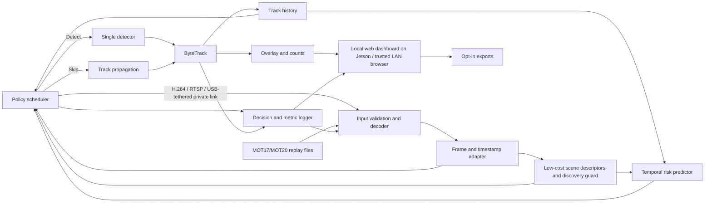

# RACE-MOT System Architecture and Interfaces

**Status:** Updated 6 October 2026 — logical architecture; deployment candidates recorded, feasibility not yet verified.  
**Architecture constraint:** one camera stream, one detector, ByteTrack, one edge device, binary detector invocation.

## 1. Component view

The diagram expresses logical dependencies, not a thread/process design. Decide concurrency only after profiling and ensure measurements include any scheduling overhead.

## 2. Frame-level data flow

1. Decoder emits a frame with a monotonic timestamp and source-frame index.
2. A frame adapter validates dimensions/timestamp and maintains input/drop counters.
3. Compute the low-resolution thumbnail/frame-difference statistics once on each arriving frame and share them with the optional scene-context input and discovery guard. Activity outside padded active-track regions may upgrade a planned SKIP to full-frame DETECT; this guard cannot cancel a planned detection. Tune its threshold on policy-validation sequences and measure its false-trigger rate and complete cost.
4. Track history feeds the temporal risk model. Store elapsed seconds, source-frame count since detector update, and consecutive detector skips separately. Compare track-only and simple context-concatenation variants; if feasible, compute a small scene-context embedding once per frame and gate it into per-track representations. Reuse that frame embedding across tracks and measure its full cost.
5. The risk scheduler plans the action for the **next** input frame using information already observed; the scene guard evaluates the new frame before detection and may only upgrade SKIP to DETECT. No future frame or ground truth enters runtime decisions.
6. Detector results, when scheduled, are passed to ByteTrack. When skipped, active tracks are propagated by the frozen primary tracker policy.
7. Track state, overlays/counts, policy evidence, latency, power/temperature telemetry, and errors are emitted to the UI/logger.
8. Exports are generated only on user request and follow retention settings.

## 3. Module contracts

| Module | Input | Output | Contract / failure behavior |
|---|---|---|---|
| Input adapter | Primary: IP Webcam H.264/RTSP stream over a USB-tethered private link; MOT replay files for evaluation; authorized local clip as fallback | Frames, timestamps, source metadata | Reject unreadable input; preserve timestamps; report decode/network gaps and reconnects; never log stream credentials. |
| Scene descriptor / discovery guard | Current/prior thumbnail, current frame, and active-track boxes | Fixed-size context vector plus optional `force_detect` reason | Deterministic and bounded; guard can upgrade only SKIP to DETECT. Record duration/false triggers and disable it if discovery benefit does not justify overhead. It is product robustness, not a novelty claim. |
| Detector | Frame and frozen detector configuration | Boxes, classes, scores | Report load/inference errors; keep preprocessing/postprocessing timing. |
| Tracker | Detections or skip/propagation event plus state | Temporary track IDs and boxes | Same tracker parameters for every policy; state reset between sequences. |
| Risk predictor | Recent per-track history including actual detector gap; optional shared scene-context embedding | Per-track risk score/probability and model version | Mark invalid/inactive tracks; report parameter count and model/fusion time; calibration is an empirical result, not a guarantee. Gated context fusion is an optional ablation, not a separate novelty claim. |
| Scheduler | Aggregate risk, active tracks, skip count, fixed threshold, scene-guard override | Next-frame detect/skip command and reason code | Enforce max consecutive skips; fallback to detection if no tracks, invalid risk, or safety condition. The scene guard may upgrade SKIP only. |
| Logger | Frame, action, outputs, timers, hardware readings | Append-only run records and summary | Do not log raw frames by default; handle disk-full/error without corrupting inference state. |
| UI/export | Run status and aggregate records | Local overlay/status, CSV/JSON, optional annotated video | User can stop cleanly; exports carry run/configuration IDs and privacy notice. |

## 4. Scheduler contract

The MVP action set is exactly:

- **DETECT:** invoke the single detector on the next frame, update ByteTrack, and reset the consecutive-skip counter.
- **SKIP:** omit detector inference on the next frame, propagate active tracks according to the frozen baseline behavior, and increment the counter.

Force DETECT on initialization, when no tracks are active, when model/risk output is invalid, or when the fixed maximum skip count is reached. The per-track risk controller plans the next action. On arrival, the scene-discovery guard checks low-resolution frame activity outside padded active-track regions and may upgrade SKIP to DETECT; it cannot create another compute mode or downgrade a planned detection. No online risk-threshold tuning; risk and guard thresholds are selected on validation sequences and frozen for evaluation.

## 5. Run record schema (minimum)

Each run has a unique ID and records: UTC/local start time; source identifier; source-frame index and timestamp; model/tracker/policy versions and hashes; input dimensions/cadence; detect/skip action and explicit reason code; skip count; maximum-risk temporary track; per-track/frame risk and calibration status; threshold; necessary scene/track feature values; track/detection counts; end-to-end and component latency; dropped/decode-error indicators; memory; available power/temperature/clock telemetry; and clean-stop/error status. A logged feature does not by itself explain or cause the action.

Do not persist image frames or identity-labelled ground truth in routine application logs. Keep evaluation annotations in the offline evaluation toolchain with access controls.

## 6. Frozen working choices and remaining architecture decisions

- Device: available Jetson Orin Nano; inventory exact memory/SKU, installed software, and measurement capability before setup.
- Live demo input: one stationary phone camera using IP Webcam H.264/RTSP over a direct USB-tethered private link. No public relay/cloud. MOT17/MOT20 recorded files remain the source for repeatable evaluation.
- Detector candidate: YOLOX-Tiny, TensorRT FP16 candidate deployment; exact checkpoint, export, and license must pass the G1 feasibility check.
- Dashboard decision: minimal local web UI served by the Jetson and accessed only on the trusted LAN; choose the lightweight framework during implementation. No public bind or cloud dependency.
- Phone app/OS, stream reconnect timeout, and final input cadence; initial 1280×720, 15 fps H.264 profile if supported, to be frozen only after the baseline.
- How source-frame gaps, wall-clock elapsed time, and consecutive detector skips are represented separately in tracker/model features.
- Scene-guard region padding, activity statistic, and threshold; retain only if new-track discovery benefits outweigh false triggers and measured pipeline cost.
- Annotated-video export remains off unless explicitly enabled.

Resolve these in [the decision log](08_decisions_and_pre_code_gate.md). Do not start a broader architecture before these choices are accepted.
