# RACE-MOT Software Design Document

**Version:** 0.3
**Date:** 8 October 2026
**Status:** Bounded G1 inventory, MOT replay, FP32 detector/output/parity, and upstream ByteTrack feasibility tools exist. Production detector/tracker adapters, baseline orchestrator, risk predictor, integrated scheduler, scene-discovery guard, evaluation runner, and dashboard remain planned behind G4. Phone work is deferred under D-33.
**Product:** Local, single-camera pedestrian MOT prototype for Jetson Orin Nano.  
**Research method:** Calibrated, per-track prediction of avoidable identity failure under a specified next-frame detector-skip action, used for detector scheduling and evaluated against matched prior methods.

## 1. Purpose and design rules

This document describes the software structure, interfaces, run data, deployment assumptions, and development order for RACE-MOT. It is the implementation-level companion to the [product requirements](../product_docs/02_product_requirements.md), [logical architecture](../product_docs/03_system_architecture.md), [data/model plan](../product_docs/04_data_and_model_plan.md), and [readiness gate](../product_docs/08_decisions_and_pre_code_gate.md).

The design follows these rules:

1. **Keep the product small:** one video source, one detector, ByteTrack, one Jetson Orin Nano, and exactly two detector actions: `DETECT` and `SKIP`.
2. **Make the baseline the first complete pipeline:** detector-every-frame + ByteTrack must be measurable before enabling the learned policy.
3. **Keep runtime inputs causal:** the live controller may consume only current and past frames, detections, and tracker state. Ground-truth annotations and future frames exist only in offline training/evaluation.
4. **Treat measurement as a product feature:** log the complete pipeline and its configuration, including predictor, policy, decode, and required output overhead.
5. **Separate camera packet loss from policy skipping:** network/source frame loss is an input event; detector skipping is a policy action. Log and analyze them separately.
6. **Default to local and transient video:** don't write raw or annotated video unless the user explicitly exports an authorized demo.
7. **State the proposal novelty claim; keep measured claims evidence-bound.** The method claim is calibrated per-track prediction of avoidable identity failure under a specified detector-skip action, used for next-frame detector scheduling. Record performance, calibration, and energy results separately with hardware, model, and configuration manifests.

## 2. Product scope

### 2.1 In scope

- One stationary, authorized mobile-phone camera stream from IP Webcam delivered as H.264 over RTSP on a private USB-tethered local link.
- Recorded MOT17/MOT20 video replay for repeatable benchmark analysis; MOT17 is the development/evaluation source and MOT20 is held out for crowded-scene stress/generalization.
- One provisional person detector: YOLOX-Tiny, 416-pixel model input, TensorRT FP32 on the currently verified board path. FP16 conversion is blocked on the installed JetPack image and must be re-evaluated only through an official compatibility path. Freeze the exact checkpoint and terms before baseline measurement. The [official YOLOX repository](https://github.com/Megvii-BaseDetection/YOLOX) documents Tiny/Nano variants and TensorRT deployment; this does not settle the terms of every released checkpoint.
- One primary tracker: ByteTrack, with one pinned version and configuration used by all policy variants.
- Baseline mode (detector on every frame) and adaptive mode (detector invocation controlled by calibrated future-failure risk).
- Local dashboard with temporary tracks, active-track count as an occupancy proxy, run status, current action, timing, and error state.
- Offline label generation, model training/calibration, threshold selection, sequence-level evaluation, and full-pipeline energy/latency measurement.

### 2.2 Out of scope

Multiple cameras, cross-camera identity, face recognition, Re-ID, cloud video processing, multi-stream scheduling, learned Mamba/SSM motion replacement, ROI/patch detector actions, pseudo-depth association, optical-flow propagation, variable resolution, thermal-state-driven compute actions, continual learning, and a newly collected public dataset are excluded from the MVP. A change requires a scope decision and updates to product, privacy, architecture, prior-art, and verification documents.

The product reports detected tracks and an active-track count. It does not claim validated people counting, line-crossing flow analysis, identity recognition, or safe use in consequential decisions.

## 3. System architecture

### 3.1 Logical components

```mermaid
flowchart LR
  Phone[Phone camera RTSP] --> Source[Frame source and timestamp adapter]
  Replay[MOT/local video replay] --> Source
  Source --> Orchestrator[Run orchestrator]
   Orchestrator --> Features[Per-track history and scene features]
   Source --> Guard[Low-cost scene-discovery guard]
   Guard --> Scheduler[Two-action scheduler]
  Features --> Predictor[Temporal risk predictor]
  Predictor --> Calibrator[Risk calibration and frame aggregation]
   Calibrator --> Scheduler
  Scheduler -->|DETECT| Detector[YOLOX-Tiny detector adapter]
  Scheduler -->|SKIP| Propagate[ByteTrack skip/predict adapter]
  Detector --> Tracker[ByteTrack adapter]
  Propagate --> Tracker
  Tracker --> History[Track history]
  Tracker --> Results[Tracks and occupancy proxy]
  Scheduler --> Log[Metrics and decision log]
  Results --> Log
  Results --> Dashboard[Local dashboard]
  Log --> Dashboard
  Eval[MOT annotations and offline rollouts] --> Training[Train, calibrate, validate]
  Training --> Predictor
```



The runtime should be a **single Python application process** with sequential detector/tracker state updates. The source reader and local HTTP dashboard may run independently so display requests don't block inference. No detector calls may overlap. Final worker/queue mechanics must be frozen after the first device profile; recorded-file evaluation must be deterministic and preserve every source frame unless the experiment explicitly models input loss.

### 3.2 Existing implementation vs planned modules

| Module | Current state | Responsibility |
|---|---|---|
| CLI (`cli.py`) | Implemented for preflight | `inventory`, `probe`, `mot-probe`, `detector-smoke`, `validate-config`, and `inspect-mot`. |
| Device inventory (`inventory.py`) | Implemented | Read-only system/software metadata collection; no board configuration changes. |
| Stream probe (`stream_probe.py`) | Implemented | Open local video/RTSP input, measure read/decode timing, and report redacted metadata; never writes frames. |
| MOT sequence probe (`stream_probe.py`) | Implemented for G1 | Decode a bounded JPEG prefix, validate dimensions/order, and retain no images. |
| Detector smoke (`detector_smoke.py`) | Implemented for G1 | TensorRT FP32 execution, YOLOX grid decode/NMS, coordinate restoration, bounded ground-truth overlap, and optional OpenCV DNN parity; not the production detector adapter. |
| Source adapter | Planned | Normalize local files and RTSP into `FramePacket`; preserve source frame index, timestamp, and input-drop events. |
| Detector adapter | Planned | Run the selected YOLOX-Tiny model and return canonical person detections. |
| ByteTrack adapter | Planned | Wrap the pinned tracker implementation; distinguish detector output `[]` from an intentional detector skip. |
| Feature/history store | Planned | Maintain bounded per-track history with elapsed seconds, source-frame gap, and consecutive detector skips, plus one optional scene-context vector per frame. |
| Risk model and calibrator | Planned | Primary candidate is a causal-in-time track-history TCN; compare GRU/temporal MLP and track-only, context-concatenation, and optional shared-context gated-fusion variants. Score tracks, aggregate frame risk, and mark calibration validity. Report results by detector-gap bin. No fixed parameter or sub-millisecond target is assumed. |
| Scene-discovery guard | Planned | Reuse the once-per-frame low-resolution thumbnail/frame-difference features; check activity outside padded active-track boxes and upgrade a planned `SKIP` to full-frame `DETECT` for new activity or abrupt scene change. It cannot downgrade a planned detection. Measure discovery delay/recall, false triggers, and cost; this is a product safety mechanism, not novelty. |
| Scheduler | Standalone primitive; runtime integration planned | Select binary next-frame `DETECT` or `SKIP`, apply the scene-guard override and hard fallbacks, and emit reason codes. |
| Evaluation/label tools | Annotation reader and outcome-label primitive; full evaluation planned | Create offline counterfactual labels, run sequence-level metrics, calibration and statistical summaries. |
| Run logger/telemetry | Planned | Store configuration, per-frame actions/metrics, summary, and hardware measurements. |
| Dashboard/export | Planned | Show latest run snapshot and export summary/decision log; video export stays opt-in. |

## 4. Repository layout

```text
edge/race_mot/
├── pyproject.toml
├── README.md
├── SDD.md
├── configs/                     # present: versioned non-secret run configs
├── models/                      # local checkpoints/engines; not committed unless terms allow
├── reports/                     # local device/input feasibility reports
├── runs/                        # local run manifests, frame logs, summaries
└── src/race_mot/
    ├── __init__.py              # present
    ├── cli.py                   # present: inventory/probe/smoke/validation commands
    ├── inventory.py             # present
    ├── stream_probe.py          # present: stream and MOT sequence probes
    ├── detector_smoke.py        # present: bounded G1 TensorRT/reference checks
    ├── application.py           # planned: run lifecycle/orchestration
    ├── config.py                # present: JSON configuration validation
    ├── domain.py                # present: frame/detection/track/action records
    ├── sources/                 # planned: file and RTSP source adapters
    ├── detectors/               # planned: YOLOX/TensorRT interface
    ├── trackers/                # planned: ByteTrack adapter
    ├── risk/                    # planned: features, TCN/GRU/MLP, calibration
    ├── policy.py                # present: standalone scheduler primitive
    ├── evaluation/              # present: annotation/label primitives; full runner planned
    ├── telemetry/               # planned: Jetson sampler and energy sync
    ├── logging/                 # planned: manifests and per-frame records
    └── web/                     # planned: local dashboard
```

`models/`, `runs/`, `reports/`, local camera settings, MOT archives, and private data are excluded by the current `.gitignore`. Do not place raw MOT datasets or phone video in the source package.

## 5. Runtime data contracts

The exact implementation language is Python. Core record classes are in `domain.py`; adapter and runtime APIs below remain planned.

### 5.1 `FramePacket`

| Field | Type | Meaning |
|---|---|---|
| `run_id` | `str` | Unique run identifier. |
| `source_index` | `int` | Original source frame number where available; never renumber silently after a drop. |
| `source_timestamp_ms` | `float | None` | Presentation/source timestamp if provided by decoder. |
| `arrival_monotonic_ns` | `int` | Local monotonic arrival time used for latency and ordering. |
| `image_bgr` | `np.ndarray` | In-memory decoded frame; never included in routine logs. |
| `source_kind` | enum | `rtsp`, `video_file`, or `mot_sequence`. |
| `input_drop_count` | `int` | Number of source frames known to have been lost/dropped before this packet. |

The source adapter emits distinct states for frame, end-of-file, temporary stream loss, unrecoverable error, and user stop. Credentials and raw RTSP URLs are not included in `FramePacket` logs.

### 5.2 `Detection`

```text
Detection:
  xyxy: (x1, y1, x2, y2) in original-frame pixels
  score: float in [0, 1]
  class_id: int
  class_name: "person" for the MVP
```

The detector adapter owns resizing/letterboxing and coordinate restoration. Its public output is always original-frame coordinates, independent of TensorRT engine dimensions. Detector inference, preprocessing, postprocessing/NMS, and engine warm-up are timed distinctly. Batch size is one.

### 5.3 `TrackSnapshot`

```text
TrackSnapshot:
  temporary_track_id: int
  xyxy: (x1, y1, x2, y2) in source-frame pixels
  score: float | None
  state: tracked | predicted | lost | removed
  age_frames: int
```

IDs reset for each run and are not stable identifiers across runs. The UI may show current or predicted states, but must distinguish them. `active_track_count` is the number of currently displayed active tracks, not ground-truth occupancy.

### 5.4 Detector and tracker APIs

```text
Detector.load(engine_or_checkpoint, config) -> None
Detector.detect(frame_packet) -> list[Detection]
Detector.close() -> None

Tracker.initialize(detections, frame_packet) -> list[TrackSnapshot]
Tracker.update(detections, frame_packet) -> list[TrackSnapshot]
Tracker.skip(frame_packet) -> list[TrackSnapshot]
Tracker.reset() -> None
```

`update([])` means the detector ran and found no accepted people. `skip()` means the detector did not run. These events may both advance tracker time, but they must remain distinguishable to the scheduler, feature history, and run log. The adapter must advance motion state using elapsed source timestamps; skip behavior (including ByteTrack's lost-track lifecycle and which predictions are displayed) is a feasibility decision to verify against the selected implementation. Do not silently treat a skipped frame as an actual detector result.

### 5.5 Scheduler API

```text
DetectorScheduleState:
  source_frame_index: int
  timestamp_monotonic_seconds: float
  seconds_since_last_detector_run: float
  source_frames_since_last_detector_run: int
  consecutive_detector_skips: int

RiskModelInput:
  per_track_history: map[temporary_track_id, normalized_feature_sequence]
  detector_schedule_state: DetectorScheduleState
  scene_context: vector | None

PolicyInput:
  current_frame_index
  calibrated_track_risks: map[temporary_track_id, probability]
  active_track_count
  consecutive_detector_skips
  seconds_since_last_detector_run
  source_frames_since_last_detector_run
  predictor_valid
  scene_activity_score_outside_tracks
  scene_guard_triggered

PolicyDecision:
  planned_action: DETECT | SKIP
  executed_action: DETECT | SKIP
  applies_to_frame_index: int
  reason: INITIALIZE | RISK_THRESHOLD | NO_TRACKS | MAX_SKIP | INVALID_RISK | LOW_RISK | SCENE_ACTIVITY_OVERRIDE
  frame_risk: float | None
  threshold: float | None
  scene_activity_score: float | None
```

After frame $t$ is processed, the risk scheduler plans the action for the **next** source frame. Initialization always plans `DETECT`. Force `DETECT` when there are no active tracks, risk is invalid, calibrated frame risk is at/above $\tau$, or the maximum consecutive skip count $S_{max}$ is reached. Otherwise plan `SKIP`. When the next frame arrives, the low-resolution scene-discovery guard may upgrade `SKIP` to `DETECT` if activity outside padded active-track boxes exceeds its validation-selected threshold. It can never downgrade `DETECT`. Record both planned and executed action and the override reason. All threshold selection happens offline on validation sequences; the running application never adapts a threshold from test annotations.

For multiple track risks, the initial aggregation is $Q_t=\max_i q_{i,t}$, followed by a separately fitted frame-level calibration map. If the active-track set is empty, invoke the detector regardless of $Q_t$.

## 6. Processing flows

### 6.1 Baseline/live run

1. Validate configuration, input, model/checkpoint provenance, and output path.
2. Create `run_id`, write the immutable run manifest, initialize decoder, model, tracker, sampler, and dashboard.
3. Read a `FramePacket`; record input arrival and source timestamps.
4. In baseline mode, run the detector on every frame. In adaptive mode, use the action planned after the previous processed frame; first frame is always detected. Before executing a planned `SKIP`, evaluate the current-frame scene-discovery guard; it may upgrade the action to `DETECT` but cannot downgrade `DETECT`.
5. Run `Tracker.update(...)` after detection or `Tracker.skip(...)` after skipping. Update elapsed detector time, source-frame gap, and skip count separately.
6. Build causal history/context features, predict risk for active tracks, calibrate the maximum track score to frame risk, and schedule the next frame.
7. Emit tracks, occupancy proxy, action evidence, stage timings, input-drop counters, and periodic hardware telemetry to the in-memory dashboard snapshot and log writer.
8. On stop, close resources, flush logs, write summary, and leave raw video absent unless the user explicitly enabled authorized export.

### 6.2 Offline learning/evaluation flow

1. Load MOT17 annotations and group all detector variants of the same source video into one fold.
2. Run the frozen detector/ByteTrack to create anchor states and paired offline rollouts.
3. Label avoidable failures using the fixed visible-identity, wrong-assignment, and persistence rules and the selected $K$, $M$.
4. Fit feature scaling and predictor parameters on training sequences only.
5. Fit calibration on disjoint natural-prevalence calibration sequences; choose threshold and skip limit on separate policy-validation sequences. Use grouped/cross-fitted procedures when sequence counts prevent a stable simple split.
6. Fit guard threshold on policy-validation sequences; evaluate risk-only versus risk-plus-guard and report new-track discovery delay/recall and false-trigger rate.
7. Freeze model/calibrator/configuration before the outer MOT17 evaluation; evaluate MOT20 without tuning. Report calibration and policy results by detector-gap bin.
8. Report model metrics, tracking metrics, full-pipeline device metrics, repeated-run/sequence uncertainty, and deviations from closest-work reproductions, including the ALBIREO-like scheduler adaptation.

Phone-captured demo video is not used as labeled training or benchmark data by default.

## 7. Configuration and command interfaces

### 7.1 Implemented commands

The installed CLI currently supports:

```text
race-mot inventory [--output PATH]
race-mot probe (--input SOURCE | --input-env VARIABLE) [--duration-sec N] [--output PATH]
race-mot mot-probe --sequence PATH [--frames N] [--output PATH]
race-mot detector-smoke (--input SOURCE | --input-env VARIABLE | --mot-sequence PATH) --engine PATH [--reference-onnx PATH] [--frames N] [--output PATH]
race-mot validate-config --config PATH
race-mot inspect-mot --gt PATH
```

The `inventory` command is read-only. Probe and smoke commands read frames but do not save them. Their rates/timings are not end-to-end MOT performance. These are G1 utilities, not a finished product interface.

### 7.2 Planned commands

```text
race-mot run --config CONFIG [--mode baseline|adaptive]
race-mot evaluate --config CONFIG --sequences MANIFEST
race-mot train-risk --config CONFIG --fold FOLD
```

Command names are provisional until the baseline path is implemented.

### 7.3 Configuration ownership

Version non-secret defaults and experiment settings in YAML/JSON. Required sections:

```yaml
run:
  mode: baseline              # baseline first; adaptive only after readiness gate
  seed: 0
  output_root: runs
input:
  kind: mot_sequence          # active local path; rtsp remains deferred under D-33
  expected_width: 1920
  expected_height: 1080
  expected_fps: 30
detector:
  family: yolox_tiny
  engine_path: models/provisional/yolox_tiny_fp32_diagnostic.engine
  checkpoint_sha256: TBD
  input_size: [416, 416]
  precision: fp32
  batch_size: 1
tracker:
  family: bytetrack
  implementation_version: d1bf0191adff59bc8fcfeaa0b33d3d1642552a99
  parameters_file: configs/bytetrack.json
risk:
  model_path: null            # null for baseline mode
  calibration_path: null
  horizon_K: TBD
  persistence_M: TBD
policy:
  threshold_tau: TBD
  max_consecutive_skips: TBD
measurement:
  deadline_ms: TBD
  telemetry_interval_ms: 1000
dashboard:
  bind_address: 127.0.0.1     # loopback by default; explicit trusted-LAN address requires review
  port: 8765
  save_annotated_video: false
```

Values marked `TBD` cannot be used for adaptive evaluation. The initial phone profile is a feasibility starting point, not a performance target. Never commit RTSP passwords, private IP credentials, user paths, or institution-only footage metadata.

## 8. Run artifacts and storage

Each run writes to a unique directory under the configured local `runs/` path:

```text
runs/<run_id>/
├── manifest.json       # device/runtime/model/configuration hashes and source kind
├── frames.jsonl        # one record per processed source frame
├── telemetry.csv       # timestamped memory, power, clocks, and temperature samples
├── summary.json        # metrics and run completion/error state
└── annotated.mp4       # absent unless authorized opt-in export was selected
```

Per-frame record fields include run ID; source-frame index/timestamps; input-drop count; planned and executed detector action with explicit trigger/reason code; wall-clock and source-frame detector gap; consecutive skip count; scene activity score/guard override; track/detection counts; maximum-risk temporary track ID; per-track/frame risk and calibration-validity status; threshold; model/configuration hashes; feature-vector version and only the feature values required by the audit plan; decode, detector, scene-guard/context extraction/fusion, predictor, tracker, render/log, and end-to-end latency; error/drop flags. A feature recorded alongside an action is evidence available to the policy, not proof that it caused the action. Never log frames, person names, appearance embeddings, stable cross-run identities, credentials, or ground-truth labels in a runtime run record.

Write records incrementally with bounded memory. The UI reads a recent in-memory snapshot; a slow browser must not block inference. A log-write failure raises a visible run warning and is recorded if possible; it must not corrupt tracker state. Summary metrics unavailable for a live, unlabeled phone demo must be marked unavailable rather than estimated as HOTA/IDF1.

Keep authorized logs in the project workspace until assessment completion and delete within 90 days, unless the institution requires earlier deletion. Raw video and annotated export are off by default. Avoid copying logs or footage into cloud-synced folders.

## 9. Runtime, errors, and security

### 9.1 Runtime and deployment

- Target device: the available Jetson Orin Nano. Exact module RAM/SKU, carrier, thermal assembly, JetPack, CUDA/TensorRT, Python, and available telemetry are recorded by the inventory command before installation changes.
- Preserve the installed NVIDIA image for the first feasibility pass. The [NVIDIA JetPack support matrix/download page](https://developer.nvidia.com/embedded/jetpack/downloads) changes over time; lock the exact compatible software release in the run manifest rather than assuming the latest release is suitable.
- Train the risk model in an approved offline development environment using public MOT annotations; deploy only the frozen inference model/calibrator to Jetson. No raw phone video is uploaded for training.
- The intended application requires no cloud service at runtime. The RTSP camera and dashboard communicate on the private USB-tethered local link or configured trusted LAN only; verify observed network behavior before making a zero-leakage claim.
- The local web service binds to loopback by default. If another trusted device must access the dashboard, configure the Jetson's private LAN address explicitly and prevent router port-forwarding/public exposure.

### 9.2 Failure behavior

| Failure | Required behavior |
|---|---|
| Invalid config/model/checkpoint | Fail before opening camera; show actionable error; do not create a misleading successful-run summary. |
| RTSP open/read loss | Show stream state and timestamp; attempt a bounded reconnect if implemented; count and log source drops separately; stop cleanly after configured retry policy. |
| File decode error/end | Distinguish normal EOF from damaged input; finalize logs; never reuse tracker state across sequences. |
| Detector/risk output invalid | Force `DETECT` for policy fallback; if detector itself fails, stop the run and mark it failed. Never silently substitute zero risk. |
| Tracker error | Stop or reset only under a documented recovery rule; record identity continuity as broken after reset. |
| Disk full/log failure | Alert user, stop cleanly if required evidence cannot be written, and preserve a failed status where possible. |
| Dashboard disconnect | Continue or stop according to user configuration; keep inference state independent of browser polling. |
| User stop/signal | Release camera, engine, server and file handles; flush logs and report a clean/unclean stop. |

### 9.3 Privacy and security

Phone stream is processed transiently. Bind services only to loopback or a configured trusted-LAN address, do not expose RTSP or dashboard ports to the public internet, redact URLs in logs, and keep credentials in environment variables or a protected local secret store. Use staged/consented/otherwise authorized footage. IDs are short-lived and reset every run. The software has no face recognition, identity profile, or cloud upload component.

## 10. Performance and evaluation design

### 10.1 Timing boundary

Primary application latency is source-frame arrival/read through emitted track/status record. Report p50/p95, throughput, source/drop counts, deadline-miss rate, and stage timings. A detector-only number is diagnostic and cannot stand in for application latency. Product UI/rendering and required logging inclusion must be declared for every comparison.

### 10.2 Energy boundary

Use an external meter at the Jetson power input as the primary whole-device measure when available, and declare whether the measured boundary includes the carrier, fan, and attached peripherals. Include decode, preprocessing, detector, scene-discovery guard, shared context extraction/encoder/fusion, predictor, calibration, policy, tracker, and required dashboard/logging/telemetry overhead. Use onboard rail telemetry only as a separately reported diagnostic/cross-check; do not combine it with external meter readings as one exact value. Report joules per **all input frames**, including detector skips; state that phone, access point, and browser power is excluded unless separately metered. Disclose input drops, warm-up, idle baseline, meter/telemetry sampling, run duration, repeat count, ambient/cooling conditions, temperature, clocks, and power mode. Do not infer energy from TOPS or FLOPs. Thermal telemetry measures sustained behavior; the MVP has no temperature-responsive controller.

### 10.3 Offline metric ownership

Tracking metrics (HOTA, DetA/AssA, IDF1, MOTA, ID switches, fragmentation, detector AP/recall, new-track discovery delay/recall, and guard false-trigger rate) are computed by the offline evaluation runner against annotations. Predictor metrics include label prevalence, PR-AUC, operating-point precision/recall, Brier score, ECE with stated bins, reliability plots, detector-gap-stratified results, and sequence-aware confidence intervals. Hardware results include joules/input frame, p50/p95 latency, deadline-miss rate, peak RAM, temperature, clocks and throttling. Frames are correlated; resampling/inference must use sequences and repeated runs as units, not pretend every frame is independent.

### 10.4 Policy constraint

The adaptive policy minimizes measured energy subject to predeclared HOTA/IDF1 non-inferiority margins, p95/deadline-miss bounds, RAM budget, and sustained temperature limit. These values remain unset until a detector-every-frame pilot establishes baseline repeatability and product cadence. If no policy meets constraints, report the negative result and do not label it energy-saving.

## 11. Design verification and traceability

| Requirement | SDD component | Evidence after implementation |
|---|---|---|
| FR-01/02 live and replay inputs | Sections 5, 6, 9 | Phone stream and file replay run records; interruption/reconnect evidence. |
| FR-03 tracks and active count | Sections 5.2/5.3, 6 | Rendered output and exported track records, described as occupancy proxy. |
| FR-04/05 baseline/adaptive mode | Sections 5.4/5.5, 6 | Frozen run config and action log; baseline detector call each frame. |
| FR-06 decision evidence | Sections 5.5, 8 | One policy/action record per processed frame, including trigger. |
| FR-07 quality/resource metrics | Sections 8, 10 | Summary with computed metrics or an explicit unavailable reason. |
| FR-08 opt-in export | Section 8 | Export review with default video absence and retention behavior. |
| FR-09 errors/stop | Section 9.2 | Stream/model/log fault/recovery records and clean process stop. |
| FR-10 scene-discovery override | Sections 5.5, 6 | Trace includes planned/executed actions, guard score/trigger, false-trigger rate, discovery delay/recall, and measured cost. |
| NFR-01/09 device provenance | Sections 7, 9.1 | Device manifest and exact environment/checkpoint hashes. |
| NFR-02/03 latency and energy | Sections 10.1/10.2 | Synchronized end-to-end latency and power/frame reports. |
| NFR-05 bounded skip policy | Section 5.5 | Trace proves startup/no-track/invalid-risk/max-skip fallbacks. |
| NFR-06/07/08 local/privacy boundary | Sections 8, 9.3 | Offline run, no default video persistence, feature/security review. |

No tests or benchmark results are implied by the SDD. Use the separate [verification plan](../product_docs/07_verification_acceptance_release.md) to define and record future evidence.

## 12. Development order

1. Finish remaining G1/G2 closure: record physical cooling, resolve acceptable detector recall and artifact/data terms, approve scene roles, and obtain supervisor acceptance for the D-33 phone deferral or resume phone acceptance later.
2. Freeze and implement `FramePacket`, source adapter, configuration validation, and run lifecycle.
3. Retain the verified TensorRT FP32/OpenCV reference contract, resolve checkpoint terms and recall, then implement the canonical `Detection` adapter after G4. Keep FP16 blocked until an official compatible path exists.
4. Integrate pinned ByteTrack commit `d1bf0191adff59bc8fcfeaa0b33d3d1642552a99` after G4; replace deprecated compatibility uses and explicitly verify `update([])` versus `skip()` semantics and track lifecycle.
5. Implement detector-every-frame + ByteTrack end-to-end baseline, local dashboard, per-frame logging, and hardware telemetry; measure before adding adaptive logic.
6. Build sequence-grouped data and paired counterfactual label pipeline; audit labels and freeze $K$, $M$, match/visibility rules.
7. Train/compare TCN, GRU, temporal MLP and simple baselines; calibrate on separate sequences. Include actual gap features and report per-gap results. Compare track-only and context-concatenation inputs; attempt shared-context gated fusion only as a measured secondary ablation.
8. Implement binary scheduler and maximum-skip guard, then the scene-discovery override. Compare direct/faithful adaptive baselines, including an ALBIREO-like object-wise uncertainty scheduler; report reproduction limits.
9. Run grouped MOT17 evaluation and frozen MOT20 stress evaluation, including scene-guard versus no-guard discovery outcomes and gap-stratified results; report all metric and energy limits honestly.
10. Package/document the local prototype and demo workflow. Consider a conference paper only if closest-prior-art review and measured evidence support it.

## 13. Open design decisions

| Decision | Current position | Closure condition |
|---|---|---|
| Orin Nano module RAM/SKU, carrier, cooling, installed JetPack | Device/software/carrier and active fan telemetry recorded; physical cooling assembly open | Visually record cooling/enclosure; no software upgrade before compatibility review. |
| Phone OS/RTSP app and actual stream profile | Basic USB H.264/RTSP decode recorded; further phone work deferred under D-33 | Obtain supervisor deferral acceptance for G4 or later verify cadence, buffering, and reconnect. |
| YOLOX checkpoint and TensorRT engine | Official-release ONNX and FP32 engine hashes recorded; bounded OpenCV parity passes; provisional recall is 25.43%; FP16 blocked | Resolve checkpoint terms and acceptable recall/full tolerance before freeze. |
| ByteTrack implementation/version and skip semantics | Commit `d1bf0191...` pinned; synthetic empty-update and ten-frame real-output smoke checks pass; adapter unimplemented | Apply minimal compatibility changes after G4 and validate association, propagation, and distinct skip behavior. |
| $K$, $M$, anchor match/visibility rules | Unset until label audit | Freeze before training; document pseudocode and edge cases. |
| Feature history length and normalization | Candidate features in data plan | Choose from training-only validation; log version and causal timing behavior. |
| Detector-gap semantics | Store wall-clock seconds, source frames, and consecutive detector skips separately | Validate against source timestamps and detector-action logs; freeze gap bins before held-out evaluation. |
| Scene-discovery guard threshold | Low-resolution frame difference/activity outside padded track regions | Tune on policy-validation sequences; retain only if entry discovery improves enough to justify false triggers and complete-pipeline cost. |
| Scene-context fusion path | Start with track history; compare concatenation, then optional shared-context gated residual for the primary TCN | The shared frame descriptor is encoded once and reused; implement the gated path only after baseline profiling and if its measured value can justify its per-track cost. The concrete candidate equation is in the research report. |
| Dashboard framework/port and LAN access | Local web dashboard; private LAN only | Select framework, security boundary, and acceptable render overhead. |
| Queue/reconnect settings and input drop semantics | File replay preserves all frames; RTSP drops logged separately | Measure source behavior and freeze a bounded policy before live demo. |
| Energy meter and telemetry accuracy | External Jetson-input meter as primary when available; onboard telemetry as separate diagnostic | Verify meter boundary/sampling; report onboard rails separately and state limitations before energy claims. |
| Performance thresholds | No numeric target yet | Derive from pilot baseline/application cadence and freeze before final evaluation. |

## 14. Revision history

| Date | Change |
|---|---|
| 6 October 2026 | Initial software design for the RACE-MOT project. Separates existing preflight tools from planned tracking/model/product components and records the data, interface, privacy, measurement, and development contracts. |
| 6 October 2026 | Added explicit detector-gap state, an ALBIREO-like uncertainty comparator, and a scene-discovery override that can only upgrade SKIP to DETECT. Added discovery/false-trigger metrics, full energy accounting for the guard, and kept learned motion replacement, ROI actions, pseudo-depth, and thermal control deferred. |
| 8 October 2026 | Reconciled the SDD with D-23 and D-29 through D-36: FP32 is the current board path, bounded MOT17/output/parity/ByteTrack feasibility exists, phone work is deferred, and full adapters remain gated by G4. |
